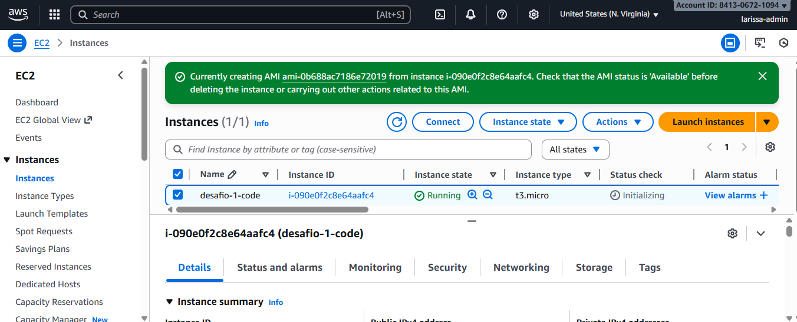
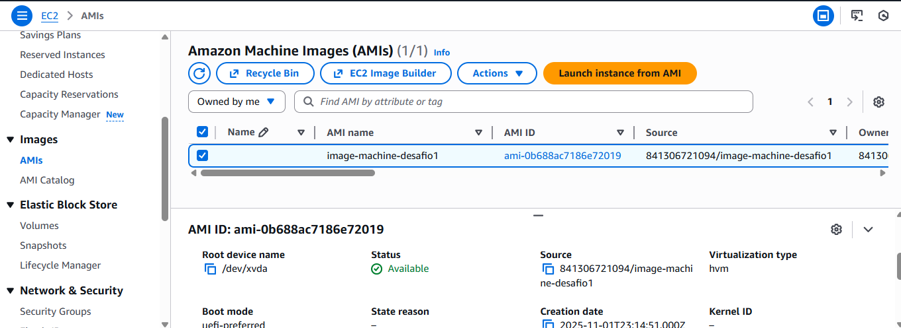
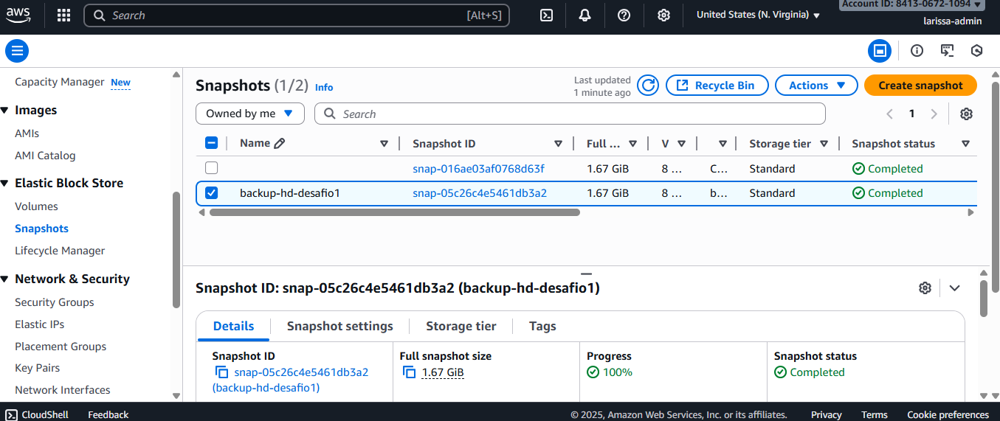

# Desafio 1: Gerenciamento Prático de Instâncias EC2

Repositório criado como entrega do primeiro Desafio de Projeto do Santander Code Girls. O objetivo foi aplicar na prática os conceitos de EC2, Snapshots e AMIs.

## Minha Execução 

Eu segui os seguintes passos no console da AWS para completar o desafio:

1.  **Criação da Instância EC2:**
    * Criei uma instância `t3.micro` com a AMI `Amazon Linux` na região `N. Virginia`.
    * Dei o nome de `desafio-1-code`.
    * Criei um novo Key Pair (`key-desafio-1`) para associar à instância.

2.  **Criação do Snapshot EBS:**
    * Com a instância rodando, fui até a aba "Volumes" e localizei o HD (EBS) dela.
    * Criei um Snapshot (backup) desse volume com a descrição `backup-hd-desafio1`.

3.  **Criação da AMI:**
    * Voltei para a lista de instâncias, selecionei minha "cobaia" e usei a opção "Create Image".
    * Dei o nome de `image-machine-desafio1` para a minha AMI.

4.  **Limpeza dos Recursos:**
    * Para não gerar custos, ao final do processo eu deletei todos os recursos na ordem correta:
        1. Encerrar (Terminate) a instância EC2.
        2. Desregistrar (Deregister) a AMI.
        3. Excluir (Delete) o Snapshot.
        4. Excluir (Delete) o Volume EBS (que ficou "available" após encerrar a instância).

## Meu Aprendizado

Essa prática foi essencial para eu entender a diferença fundamental entre um Snapshot e uma AMI, que antes era confusa para mim:

* **O Snapshot é** um backup pontual (uma "foto") **apenas do HD da máquina** (o Volume EBS).

* **A AMI é** um "molde" completo da **máquina inteira** (o HD + o sistema operacional + as configurações da instância).

Portanto, eu usaria **Snapshots** principalmente para fins de **backup** e para **restaurar os dados** de um volume que falhou. E usaria **AMIs** para **clonar** uma máquina rapidamente ou para **escalar** uma aplicação (criando várias instâncias idênticas).

## 📸 Provas (Screenshots)

Abaixo estão os prints da execução (conforme solicitado opcionalmente pelo desafio):

